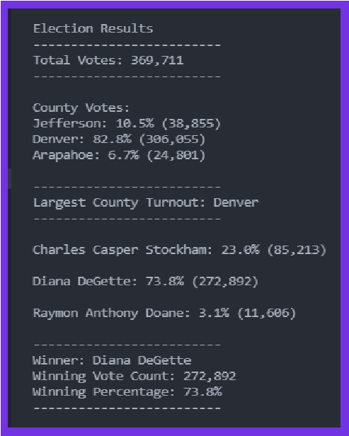
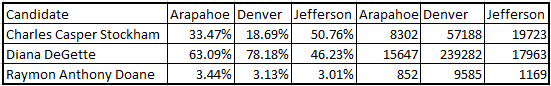

# Election_Analysis

## Overview of Election Audit:

This audit was created to report election information to the Colorado Board of Elections. They requested to know each candidate’s popular vote results. These results included:

- Total number of votes cast
- County’s name
- Number of votes from each county
- Percentage of votes from each county
- Overall county voter turnout
- Candidate’s Name
- Number of votes each candidate received
- Percentage of votes each candidate received
- The winner of the election stats

## Resources

- Data Source: election_results.csv
- Software: Python 3.7.6, Visual Studio Code 1.61.2

## Election-Audit Results:

The resulting report does address several asspects of the campain.
The following can be found in the generated report.

- Total number of votes cast for the election
- County Breakdown:
  - A complete listing of counties receiving votes
  - Number of votes for each county
  - Percentage of total votes for each county
  - Largest county turnout
- Candidate Breakdown:
  - A complete listing of candidates receiving votes
  - Total number of votes each candidate received
  - Percentage of the total votes each candidate received
- Winning Candidate's Breakdown
  - The winner of the election based on popular vote
  - Their vote count
  - The percentage of votes won

### Report Highlights

## Election-Audit Summary

This report provided some good election information. It gives
us information about votes cast. We can also see that Denver
county had cast over four-fifths of the votes. It clearly
shows the Diana DeGette is the winner of the election.

I believe even more value informatation could be captured in
this report. The spreadsheet created below shows all items that
could possibly be. 

By adding these elements we can easily see:

- Doane has a consistant vote percentage of around 3%.
- The largest popularity vote difference was in Denver county.
- DeGette and Stockham are the top runners.
- In Jefferson county, Stockham did win, but not by much.

We not only have the grand totals for each candiate but we have
the break down of votes and percentages by county. This may prove
to be more valuable than the grand totals.